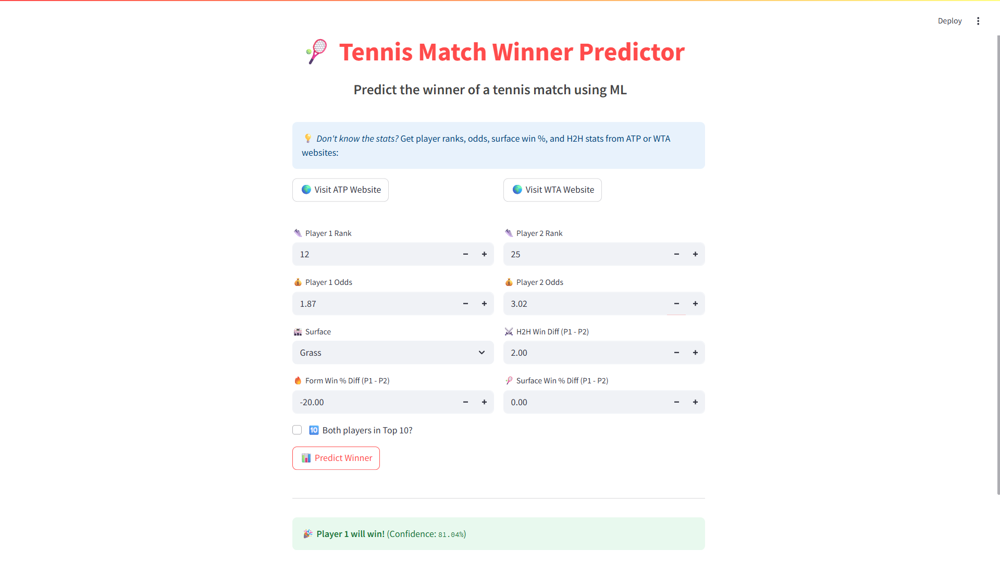

# 🎾 Tennis Match Winner Predictor

A Machine Learning-based tennis match outcome predictor using XGBoost

##  Objective
To predict the winner of a men's singles tennis match based on pre-match statistics like player rankings, odds, surface win percentages, head-to-head record, and form. The final model uses engineered features and delivers ~85% test accuracy.

##  Features Used
- Rank difference & ratio
- Head-to-head win difference
- Surface-specific win % difference
- Odds ratio
- Form-based win % difference
- One-hot encoded surface type
- Indicator if both players are Top 10

##  ML Model
- **Model**: XGBoostClassifier
- **Accuracy**: ~85.1% on test data
- **Feature Scaling**: StandardScaler
- **Eval Metric**: Logloss

##  Prediction Inputs
User provides:
- Player Ranks & Odds
- Surface
- Surface-specific win % diff
- Head-to-head diff
- Form win % diff
- Top 10 Indicator

> These inputs are processed and scaled to predict a winner along with the confidence score.

##  Web App
Built using **Streamlit** — users can enter stats and get real-time predictions.  
Also includes quick access buttons to ATP/WTA sites to find the stats.

##  How to Run

1. Clone the repo:
git clone https://github.com/arunabhiam/tennis-match-predictor.git

2. Install dependencies:
pip install -r requirements.txt

3. Launch the Streamlit app:
streamlit run app.py

## Dataset
The dataset was built by combining multiple years of ATP tour-level match data, pre-cleaned and processed to generate features like form win % and surface stats.

## Future Plans
- Auto-stats mode: Enter only player names & surface (for Top 10 players)
- Live ranking integration via ATP API
- Mobile-friendly UI

## Author
Built by **Arunabh**  
> Tennis Super Fan | AI/ML Enthusiast
